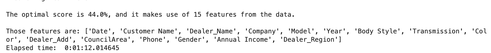

# Introduction

## Welcome to my project!

The purpose of the following project was to create a model designed to predict how much someone might spend on a car given a couple different variables. This project was actually very exciting for me and had some great learning opportunities which I will discuss later. Hopefully by discussing my data, you will get an idea of how I am trying to predict how much a person might spend on a car. A model like this obviously has a lot of practical applications and I'm sure there are a lot of inquiries about the data but the purpose of this project is just to develop a good model. Trust me, it got interesting!

## Data Collection process

My data comes from Kaggle.com and contains about 35,000 rows of data with 20 features per row. Those features were: Date, customer first name, dealer name, car company, model, year, body style, engine, transmission, color, price in thousands (target feature), dealer address, customer address, council area, phone number, gender, annual income, dealer location, dealer region, and dealer number.

## Here is a glimpse ast my initial data

## Data Cleaning

So obviously - some of these are not really so important for my analysis so I dropped them early on. Examples include customer address which had too many unique values to really contribute anything interesting to my inquiry. I also used numerical encoding to address categorical features like region (as opposed to dummy variables). Next, due to avoiding high correlation between variables, I had to remove the engine, dealer number, and dealer location features (don't worry - we didn't sacrifice anything here).

## Here is a visual to understand correlation (with a 70% filter)

## Modeling

So here... is where things got interesting. Price in thousands is a continuous variable. Therefore, there first time I tried to run a model I used linear regression. That gave me really bad results. Next, I added polynomial features and improved my score marginally. Still, I was stuck around 36%. Not good. At this point I decided to approach my data with fresh eyes and try some new tactics. I ultimately decided on synthetically turning my problem into a classification inquiry. I split car prices into 4 different intervals based on quantiles (pandas.qcut() is an awesome coding tool!). Now I was ready to run a logistic regression. I got a score of 44%. So that's definitely better but still a pretty bad score. To improve my score I took two steps. First, I turned to a random forest classifier as opposed to logistic regression. Second, I applied polynomial features. This worked really well and I got a score near 90% on my test set. So that's pretty good!

## Linear Regression

## Linear Regression with Polynomial Features

## Logistic Regression

## Random Forest with Polynomial Features

# Conclusion

#### It took some time but I was able to create a very accurate model!

## That wraps it up.

## Thanks for looking at my project!